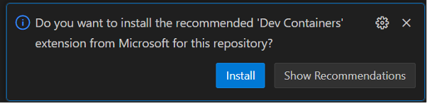
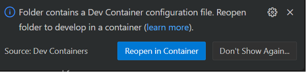
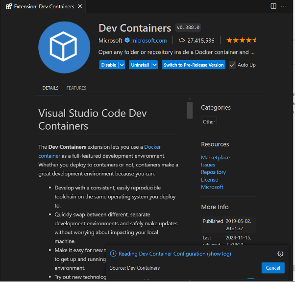
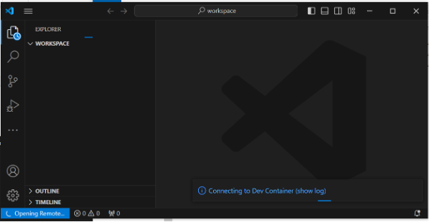
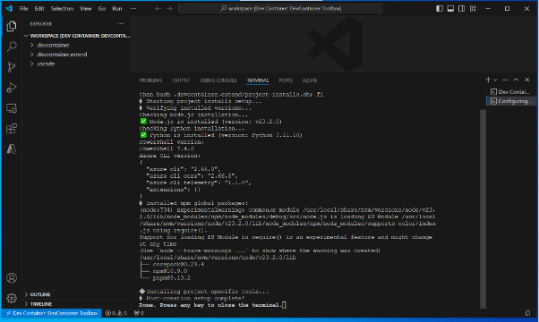

# Setup VSCode to use the devcontainer

This document describes how to set up VSCode to use the devcontainer.
You must have set up the devcontainer as described in the [setup-windows.md](./setup-windows.md) or [setup-mac.md](./setup-mac.md) file.

Next you must have copied the devcontainer toolbox to your project repository as described in the [copy-devcontainer-toolbox.md](../copy-devcontainer-toolbox.md) file.

Open a command line in the root of the repository and type:

```bash
code .
```

When you open the folder in VSCode it will detect  that there is a folder named .devcontainer. Tou will see this dialog:



```plaintext
Do you want to install the recommended 'Dev Containers' extension from Microsoft for this repository?
```

Click Install. And the devcontainer extension will install.

Next you will see this dialog:



```plaintext
Folder contains a Dev Container configuration file. Reopen folder to develop in a container (learn more).
```

Click Reopen in Container. Since this is the first time you use a container it will take some time to setup the container.


The first time you open the project that contains the devcontainer it will take some time to setup the container and install the dependencies.

When the devcontainer is built you will see this dialog:



You will see in the lower right corner of VSCode that it now open the repository in the devcontainer.
Yoou can also see that where your files are normally listed it says "WORKSPACE"

When the devcontainer is built you will see a screen that displays what is installed in the devcontainer.



The devcontainer is ready and have:

- Python
- Node (TypeScript/JavaScript)
- Poweshell
- Bash shell

## Using the devcontainer

All the files you have in the repository are now visible inside the devcontainer (mapped to the Windows/Mac host you are using). You can use the devcontainer as if it was your host machine.

Command shell
There are several command shells installed and you select the one you prefer by clicking the + sign in the terminal.


Open a bash shell by clicking the + sign in the terminal. You will see that your code on your host is mounted in the /workspaces in the folder in the container. Then type:

```bash
whoami
python --version
node --version
ls -la
```

You should see something like this:

```plaintext
vscode
Python 3.11.10
v23.2.0
```

The only difference is that you are using a container and all project dependencies are installed in the container.
