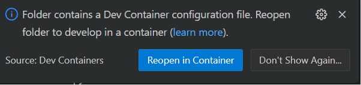

# Setting up the project inside WSL

First of all we want to make sure that your Linux distro can reach the docker daemon
that is running on Windows from inside the shell. To accomplish this open Rancher
Desktop, navigate to preferences > WSL, make sure your distro is checked and apply.


To test if we can reach the docker daemon open a powershell window, enter wsl
and paste this command:

```bash
docker images
```

If you don't get any errors we have access to the docker.socket from inside Linux.

Next we want to change the nameserver so we can reach internet from WSL.
1. Open a powershell window
2. Enter wsl
3. Paste these commands to overwrite WSL's behaviour of rewriting nameservers.

```bash
sudo rm /etc/resolv.conf
sudo bash -c 'echo "nameserver 8.8.8.8" > /etc/resolv.conf'
sudo bash -c 'echo -e "\n[network]" >> /etc/wsl.conf'
sudo bash -c 'echo "generateResolvConf = false" >> /etc/wsl.conf'
```

1. Logout of WSL with CTRL+D or exit
2. Restart WSL in powershell

```powershell
wsl --shutdown
```

1. Enter wsl
2. Try pinging google.com, if it doesn't work retrace the steps

## Setting up the projects folder

Now that we have access to both docker and internet, we can continue setting up
the project. We don't want to open a regular windows folder with WSL, we want to
connect to your distros directories.

1. In your file explorer navigate to \\wsl.localhost\Ubuntu\home\yourname
2. Shift-rightclick and open a powershell window here
3. Enter wsl
4. You decide how you want to organize your project directories, but make a new directory inside your Ubuntu homedir to make it simple. You can call it whatever you want, f.ex Projects.
```bash
cd /home && mkdir projects && cd projects
```
Clone the devcontainer repo
```bash
git clone https://github.com/norwegianredcross/devcontainer-toolbox.git
```
Or use the script to download and unpack the project.
```bash
wget https://raw.githubusercontent.com/norwegianredcross/devcontainer-toolbox/refs/heads/main/update-devcontainer.sh -O update-devcontainer.sh && chmod +x update-devcontainer.sh && ./update-devcontainer.sh
```

5. Open VSCode and make sure that WSL Ubuntu is displayed in your bottom left corner.
If you have opened VSCode in a regular folder you will get something like this which
we don't want. Please retrace the steps to open the project in WSL<br>


6. Finally open the project in the container




